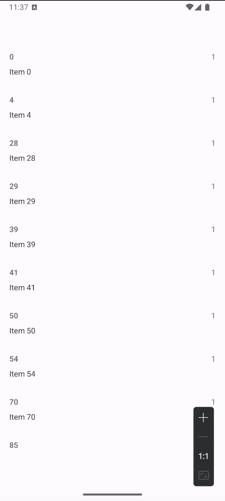

# Fetch Data Display Android App

## Overview
Fetches and displays JSON data from an API endpoint, implementing sorting and filtering logic.

### Table of Contents
- [Features](#features)
- [Implementation Details](#implementation-details)
- [Build & Deploy](#build--deploy)
- [Screenshots](#screenshots)

## Features

- Data Source: https://fetch-hiring.s3.amazonaws.com/hiring.json
- Input Format:
  ```json
  {
    "id": integer,
    "listId": integer,
    "name": string
  }
  ```
- Filtering: Excludes items with null/empty "name" field
- Sorting: Implements natural sorting by listId (ascending), then by name

## Implementation Details

### Data Processing
- Volley for API requests with custom JsonArrayRequest
- Natural number extraction: Regex pattern `\d+` for numeric sorting in names
- Custom Comparator implementation for dual-field sorting

### UI Architecture
- RecyclerView with GridLayoutManager (2 columns)
- Custom ItemAdapter with ViewBinding
- ViewHolder pattern for efficient list rendering
- Data binding using ListAdapter with DiffUtil

## Build & Deploy

```bash
# Build debug APK
./gradlew assembleDebug

# Install to connected device
./gradlew installDebug

# Run unit tests
./gradlew test

# Run instrumented tests
./gradlew connectedAndroidTest
```

Required SDK versions:
- Min SDK: 23
- Target SDK: 35
- Compile SDK: 35

## Screenshots


*Data displayed in sorted grid layout with filtering applied*

